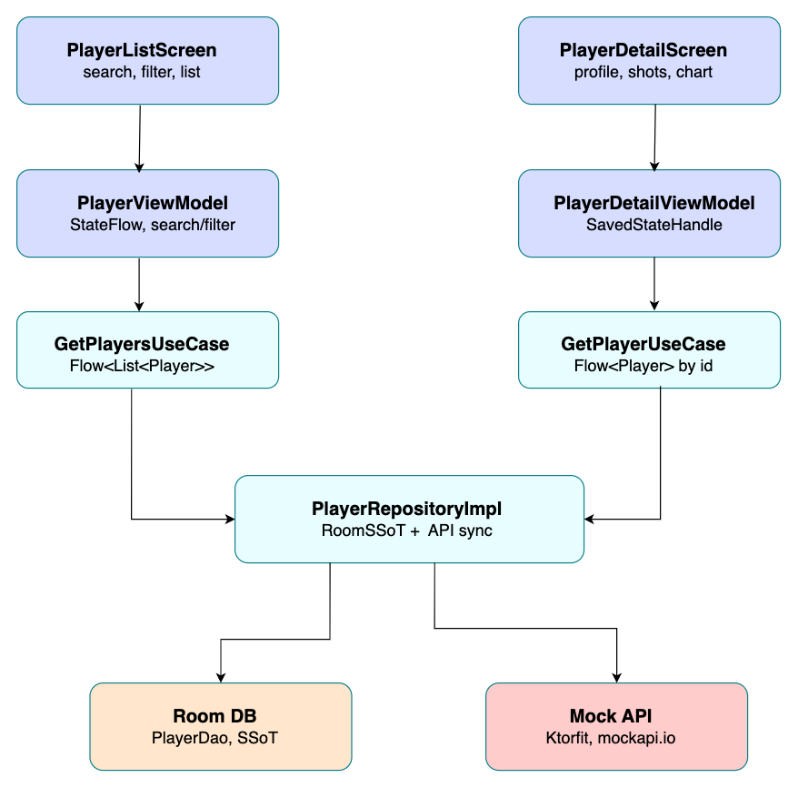
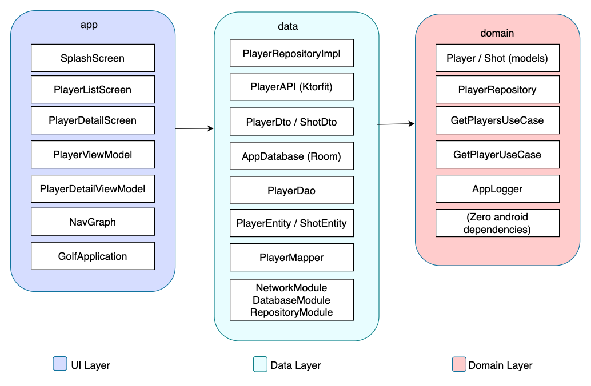

# Golf Tracker

An Android application for tracking golf player statistics and shot data, built with Clean Architecture, Kotlin, and Jetpack Compose.

---

## Architecture

### Data flow



### Component breakdown



---

## Tech stack

| Layer | Technology |
|---|---|
| UI | Jetpack Compose, Material3 |
| Navigation | Compose Navigation |
| DI | Hilt |
| Network | Ktorfit + Ktor |
| Local DB | Room |
| Image loading | Glide |
| Logging | Napier |
| Testing | JUnit, Turbine, JaCoCo, Kover |

---

## Module structure

```
golf-tracker-app/
├── app/        # UI layer — screens, ViewModels, navigation
├── data/       # Data layer — Room, Ktorfit, repository impl
└── domain/     # Domain layer — models, use cases, interfaces (pure Kotlin)
```

---

## Features

- Splash screen with animated golf ball
- Player list with search by name and filter by club type
- Offline-first — Room as single source of truth
- Pull to refresh syncs from API in background
- Player detail screen with profile, stats, and shot history
- Club distance bar chart with animation
- Light and dark theme support

---

## API

Uses [MockAPI](https://mockapi.io) as a mock backend.

| Endpoint | Description |
|---|---|
| `GET /players` | All players with shots |
| `GET /players/{id}` | Single player by id |

---

## Demo


---

## Running tests

```bash
# Unit tests (all modules)
./gradlew test

# Instrumented tests (requires device/emulator)
./gradlew connectedAndroidTest
```
